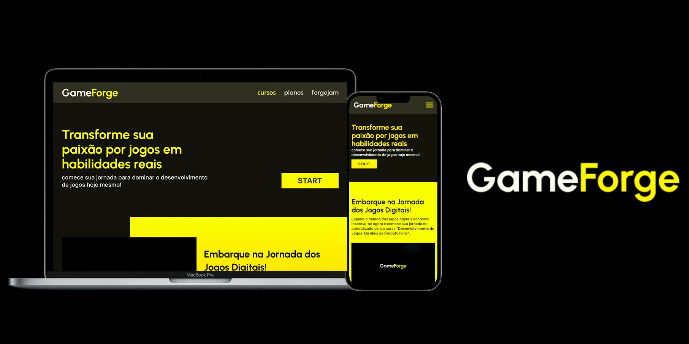

# 🕹  GameForge
Hoje em dia o que mais se tem na internet são cursos de desenvolvimento, então decidi fazer o meu próprio!

## 🔥  Introdução
A **GameForge** é um curso online fictício de desenvolvimento de games e arte, criado para um projeto pessoal. Este projeto consiste em uma página estática para a apresentação de um produto, que nesse caso, é um curso. A GameForge foi projetada do zero, desde sua prototipação em Wireframe e sua Alta Fidelidade até seu desenvolvimento utilizando de ferramenteas de desenvolvimento WEB.

## 🎮  Projeto
O objetivo principal do projeto foi aplicar os conhecimentos em UI/UX Design e Front-End, visando oferecer uma excelente experiência de usuário. Para alcançar esse objetivo:

- Criamos um **Sistema de Design** contendo tipografia, paleta de cores naturais e espaçamentos;
- Estruturamos o **HTML** de forma **semântica**, priorizando a **acessibilidade** para todos os usuários;
- O destaque do projeto está no estilo, desenvolvido exclusivamente com **CSS** puro. Utilizamos **classes utilitárias** para facilitar a manutenção do projeto;
- Implementamos práticas de **design responsivo** para garantir que o site se adapte perfeitamente a diferentes dispositivos, especialmente em telas menores;
- O próprio site já identifica se o usuário prefere **tema claro** ou **escuro**;
- Para melhorar a **usabilidade** em dispositivos móveis, criamos um menu hamburguer em **JavaScript**, proporcionando uma navegação intuitiva e acessível.

## 👨‍💻  Tecnologias

## 💻  Site

**<a href="https://nosferavic.github.io/gameforge/">GameForge</a>**
